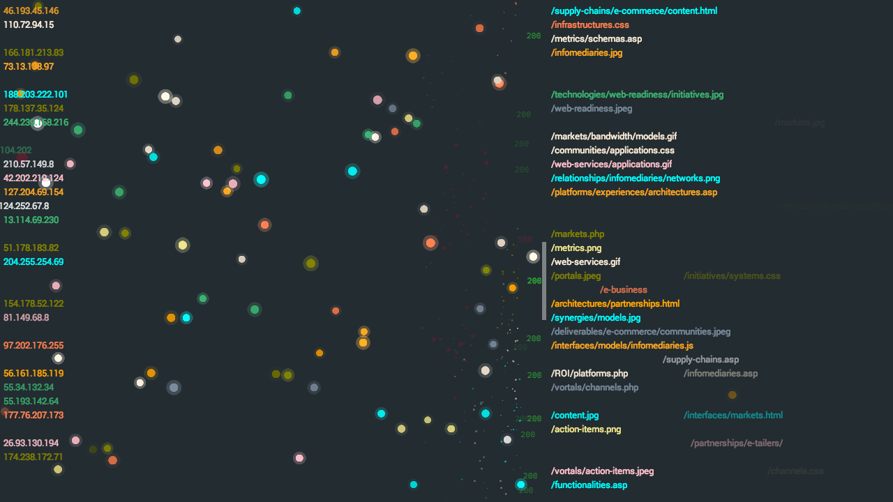

# Bogey Pong

A pong visualization for [Bogey](http://bogey.cognizo.com), heavily inspired by [Logstalgia](https://code.google.com/p/logstalgia/).

Bogey Pong represents web server traffic as a giant pong game. Every request is a ball. Successful requests (200 status
codes) are returned by the paddle, 400 status codes are misses and 500s are screen-shaking explosions.

Requests are grouped together by IP address and floods of requests from the same client are represented as long streams
of balls. This makes it really easy to pick out strange or suspicious traffic patterns.

Bogey Pong uses the [Phaser](http://phaser.io/) game engine.

It also comes with a bunch of themes based on popular coding color schemes.
